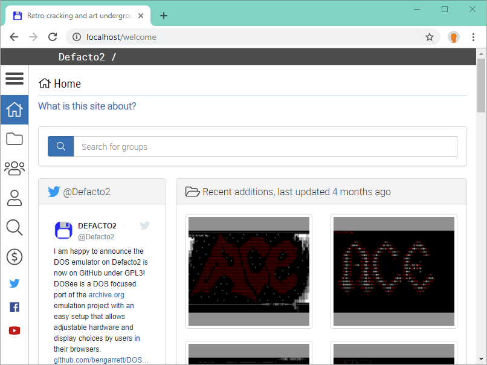

> [!WARNING]
> This documentation is retired and maybe inaccurate.

## Quick setup

### Requirements

**1.5 GB** of drive space

[Docker Desktop](https://www.docker.com/products/docker-desktop) or
[Docker Community Edition for Linux](https://docs.docker.com/install).

- Docker engine 18.06.0+ and Docker Compose 3.7 (included with the Docker installation)
- Docker Desktop for Windows must choose to use Linux containers.

[Git](https://git-scm.com/), [Yarn](https://yarnpkg.com/)

### Instructions

In a terminal or a PowerShell prompt clone this repository then build and start the container service.

```sh
git clone git@github.com:bengarrett/Defacto2-2020.git
cd Defacto2-2020
yarn

# on Linux
docker-compose -d up
```

Point a browser to http://localhost (or http://localhost:8560 on Windows)


